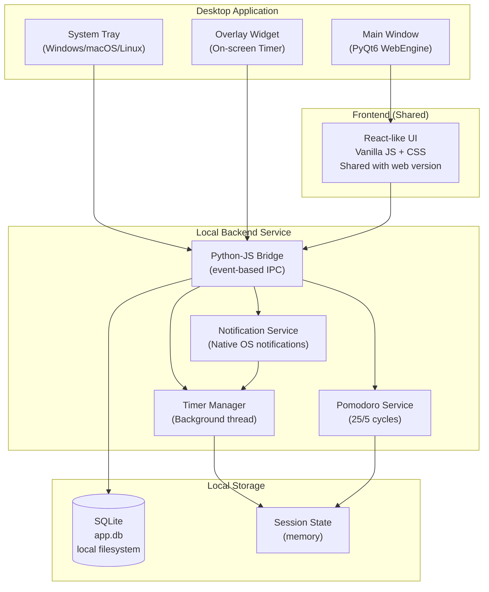
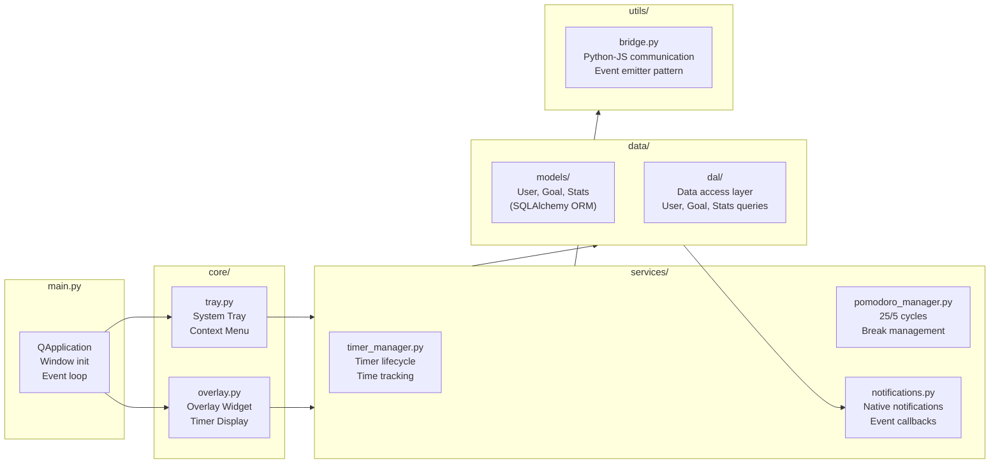
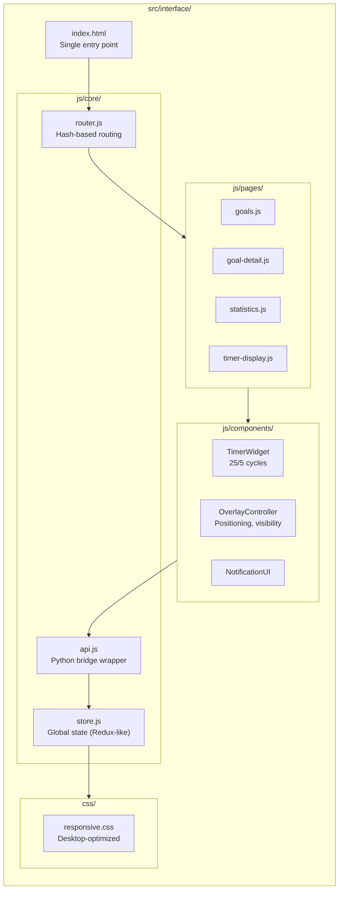
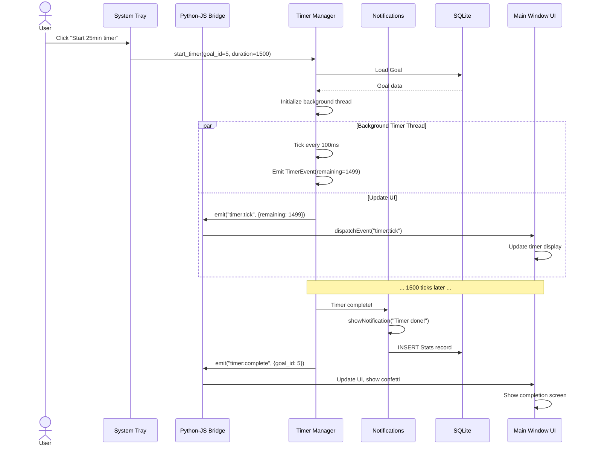

# Continium Desktop — System Architecture

**Project:** Continium Desktop — Goal & Time Tracking Desktop Application  
**Version:** 2.0 (Sprint 2+)  
**Type:** Minimum Profitable Product (MPP)  
**Date:** 2026-04-09

---

## 1. System Overview



### Key Differences from Web Version

| Aspect | Web (MVP) | Desktop (MPP) |
|--------|-----------|--------------|
| **Deployment** | Remote server (DigitalOcean) | Local executable |
| **Database** | Server-side SQLite | Local SQLite (per-user) |
| **Auth** | JWT + Email verification | Local password lock (simple) |
| **UI Framework** | FastAPI + Vanilla JS | PyQt6 + Shared JS frontend |
| **Time Tracking** | Manual logging | Timer with tray integration |
| **Notifications** | Browser only | Native OS notifications |
| **Threading** | Async/await (aiosqlite) | Sync SQLAlchemy + background threads |
| **Deployment** | Docker + Nginx reverse proxy | PyInstaller → Windows .exe, macOS .dmg |

---

## 2. Component Architecture

### 2.1 Python Backend Layer



### 2.2 JavaScript Frontend Layer



### 2.3 Data Flow: "User Starts Timer from Tray"



---

## 3. Database Schema (Local SQLite)

### Tables

#### `users`
| Column | Type | Constraints |
|--------|------|-------------|
| id | INTEGER | PK, AUTOINCREMENT |
| full_name | VARCHAR(200) | NOT NULL |
| email | VARCHAR(255) | NOT NULL, UNIQUE |
| password_hash | VARCHAR(255) | NOT NULL (bcrypt) |
| created_at | DATETIME | DEFAULT now() |

**Note:** Single-user per app instance. No multi-user or auth server.

#### `goals`
| Column | Type | Constraints |
|--------|------|-------------|
| id | INTEGER | PK, AUTOINCREMENT |
| user_id | INTEGER | FK → users.id, INDEXED, ON DELETE CASCADE |
| title | VARCHAR(200) | NOT NULL |
| type | VARCHAR(50) | "OneTime" \| "Repeating" |
| start_date | DATE | NOT NULL |
| deadline | DATE | NOT NULL |
| frequency | VARCHAR(50) | "daily" \| "weekly" \| "monthly" |
| duration_min | INTEGER | Target minutes per session |
| is_complete | BOOLEAN | DEFAULT FALSE |
| created_at | DATETIME | DEFAULT now() |

#### `stats`
| Column | Type | Constraints |
|--------|------|-------------|
| id | INTEGER | PK, AUTOINCREMENT |
| goal_id | INTEGER | FK → goals.id, INDEXED, ON DELETE CASCADE |
| user_id | INTEGER | FK → users.id, INDEXED, ON DELETE CASCADE |
| occurred_at | DATETIME TZ | INDEXED, DEFAULT now() |
| duration_minutes | INTEGER | Time logged (minutes) |

### Relationships

```
users 1 ──< goals (one user has many goals)
users 1 ──< stats (one user has many stat records)
goals 1 ──< stats (one goal has many stat records)
```

---

## 4. Python-JavaScript Bridge Communication

### Event-Based Communication Pattern

The bridge uses an **event emitter pattern** to decouple Python and JavaScript:

```python
# Python side: backend/utils/bridge.py

class JSBridge:
    """Bidirectional communication between Python and JavaScript."""
    
    def __init__(self, webengine):
        self.engine = webengine
        self._handlers = {}
    
    def on(self, event_name, callback):
        """Register a JS→Python handler."""
        self._handlers[event_name] = callback
    
    def emit(self, event_name, data):
        """Send Python→JS event (triggers JS listener)."""
        js_code = f"""
        window.dispatchEvent(
            new CustomEvent('{event_name}', {{detail: {json.dumps(data)}}})
        )
        """
        self.engine.runJavaScript(js_code)
```

```javascript
// JavaScript side: src/interface/js/core/api.js

const pythonBridge = {
    /**
     * Listen for events emitted by Python
     * @param {string} event - Event name
     * @param {Function} callback - Handler
     */
    on(event, callback) {
        window.addEventListener(event, (e) => {
            callback(e.detail);
        });
    },
    
    /**
     * Send events to Python backend
     * @param {string} event - Event name
     * @param {Object} data - Event payload
     */
    emit(event, data) {
        // Invokes Qt method on Python side
        window.qt.webChannelTransport.send({
            type: 'emit',
            event,
            data
        });
    }
};
```

### Event Catalog

**Python → JS Events:**
- `timer:start` - Timer started (goal_id, duration)
- `timer:tick` - Timer update (remaining_seconds)
- `timer:pause` - Timer paused
- `timer:complete` - Timer finished, stats logged
- `stats:updated` - Stats changed (refreshed from DB)
- `notification:show` - Show notification (title, body)

**JS → Python Events:**
- `timer:start` - User clicks "Start timer"
- `timer:pause` - User clicks "Pause"
- `timer:reset` - Reset current session
- `goal:create` - Create new goal
- `goal:delete` - Delete goal
- `stats:log` - Manual time entry

---

## 5. Threading Model

### Main Thread (UI Thread)
- PyQt6 event loop
- Processes UI interactions
- Renders JavaScript frontend

### Timer Background Thread
```python
# services/timer_manager.py

class TimerManager:
    def __init__(self):
        self._thread = threading.Thread(target=self._timer_loop, daemon=True)
        self._running = False
    
    def _timer_loop(self):
        """Background loop ticks timer every 100ms."""
        while self._running:
            time.sleep(0.1)
            self._elapsed += 0.1
            
            # Emit to UI (thread-safe)
            self._on_tick()
```

**Why background thread?**
- Timer must continue even if UI is busy
- Doesn't block event loop with sleep calls
- Allows responsive tray menu clicks

---

## 6. Local Password Authentication

Unlike the web version (JWT + email), desktop uses **simple local password**:

```python
# models/user.py

class User(Base):
    __tablename__ = "users"
    
    id: Mapped[int] = mapped_column(primary_key=True)
    password_hash: Mapped[str]  # Stored with bcrypt
    
    def set_password(self, password: str):
        """Hash password with bcrypt (cost=12)."""
        self.password_hash = bcrypt.hashpw(
            password.encode(), 
            bcrypt.gensalt(rounds=12)
        )
    
    def verify_password(self, password: str) -> bool:
        """Check password against hash."""
        return bcrypt.checkpw(
            password.encode(),
            self.password_hash.encode()
        )
```

**Comparison:**
- **Web:** JWT + email verification + password reset flow
- **Desktop:** bcrypt-hashed password, on-disk hash, login only on app startup

---

## 7. Notification System

### Windows
```python
# services/notifications.py (Windows)

from win10toast import ToastNotifier

def show_notification(title: str, message: str):
    notifier = ToastNotifier()
    notifier.show_toast(
        title,
        message,
        duration=5,
        threaded=True
    )
```

### macOS
```python
# services/notifications.py (macOS)

from pync import Notifier

def show_notification(title: str, message: str):
    Notifier.notify(
        message,
        title=title,
        timeout=5
    )
```

---

## 8. File Structure

```
Continium-Desktop/
├── src/
│   ├── main.py                 # Entry point (QApplication)
│   ├── core/
│   │   ├── tray.py             # System tray menu
│   │   ├── overlay.py          # Floating timer widget
│   │   └── main_window.py      # PyQt6 WebEngine container
│   ├── services/
│   │   ├── timer_manager.py    # Timer lifecycle + background thread
│   │   ├── pomodoro_manager.py # Pomodoro (25/5) cycles
│   │   ├── notifications.py    # OS notifications (Windows/macOS/Linux)
│   │   └── __init__.py
│   ├── models/
│   │   ├── user.py             # User ORM
│   │   ├── goal.py             # Goal ORM
│   │   ├── stats.py            # Stats ORM
│   │   └── __init__.py
│   ├── dal/
│   │   ├── user.py             # User queries
│   │   ├── goal.py             # Goal queries
│   │   ├── stats.py            # Stats queries
│   │   └── __init__.py
│   ├── utils/
│   │   ├── bridge.py           # Python-JS communication
│   │   └── db.py               # SQLAlchemy setup
│   └── interface/              # Shared with web version
│       ├── index.html
│       ├── js/
│       │   ├── core/
│       │   │   ├── api.js      # Bridge wrapper
│       │   │   ├── store.js    # Redux-like state
│       │   │   └── router.js
│       │   ├── pages/
│       │   ├── components/
│       │   └── services/
│       ├── css/
│       └── assets/
├── tests/
│   ├── test_timer_manager.py
│   ├── test_models.py
│   └── integration/
├── docs/                       # This folder
├── installer/
│   └── windows/
│       └── installer.nsi       # Windows installer script
├── build.py                    # PyInstaller builder script
├── Continium.spec              # PyInstaller spec
├── requirements.txt
├── README.md
└── .github/workflows/
    └── build.yml               # CI/CD
```

---

## 9. Configuration

| Setting | Value | Purpose |
|---------|-------|---------|
| `DATABASE_URL` | `sqlite:///app.db` | Local SQLite, relative path |
| `WINDOW_WIDTH` | 1024 | Main window width |
| `WINDOW_HEIGHT` | 768 | Main window height |
| `TIMER_TICK_MS` | 100 | Timer resolution (100ms) |
| `TRAY_MENU_ENABLED` | True | Show/hide tray menu |
| `OVERLAY_OPACITY` | 0.95 | Floating widget opacity |
| `NOTIFICATION_TIMEOUT` | 5000 | Notification duration (ms) |

---

## 10. Deployment

### Development
```bash
python -m pip install -r requirements.txt
python src/main.py
```

### Production (Windows)
```bash
python build.py --windows
# Produces: dist/Continium-Setup.exe
```

### Production (macOS)
```bash
python build.py --macos
# Produces: dist/Continium.dmg
```

**CI/CD (GitHub Actions):** Automatically builds and uploads installers on each push.

---

## 11. Security Considerations

| Area | Approach |
|------|----------|
| **Password Storage** | bcrypt with cost=12 (memory-hard, brute-force resistant) |
| **Local Data** | SQLite unencrypted; assume user controls machine security |
| **Session** | App-level session token (simple string); cleared on logout |
| **Updates** | GitHub Actions builds official installers; users run signed exe |
| **Sensitive Data** | No external APIs; all data stays local |

---

## 12. Performance Targets

| Metric | Target |
|--------|--------|
| **App Startup** | < 2 seconds |
| **Timer Accuracy** | ±100ms per minute |
| **Tray Menu Response** | < 100ms |
| **UI Responsiveness** | 60 FPS (no frame drops) |
| **Memory Usage** | < 150 MB (idle) |
| **Database Queries** | < 50ms (95th percentile) |

---

## 13. Future Evolution (Sprint 3+)

- [ ] Cloud sync (optional, encrypted)
- [ ] Goal templates
- [ ] Week/month views
- [ ] Data export (JSON, CSV)
- [ ] Dark mode toggle
- [ ] Custom sound notifications
- [ ] Goal collaboration (limited)
