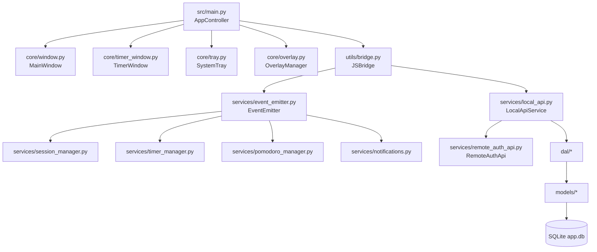

# Continium Desktop — Architecture (Code-Aligned)

**Project:** Continium Desktop  
**Scope:** Current implementation in this repository  
**Last aligned:** 2026-05-04

---

## 1. System overview

Continium Desktop is a **PyQt6 desktop shell** that hosts a **vanilla JavaScript SPA** in `QWebEngineView`.  
The frontend talks to Python through a **Qt WebChannel bridge**:

1. **Request channel** (`bridge.request`) for API-style calls (`/goals`, `/stats`, `/auth/*`).
2. **Event channel** (`bridge.emit` + forwarded `window` events) for timer/session/UI events.

Data is stored locally in SQLite (`app.db`) in the per-user app data directory. Auth endpoints are proxied to a remote API when configured.

---

## 2. Runtime architecture


```mermaid
graph TD
    A[src/main.py\nAppController] --> B[core/window.py\nMainWindow]
    A --> C[core/timer_window.py\nTimerWindow]
    A --> D[core/tray.py\nSystemTray]
    A --> E[core/overlay.py\nOverlayManager]

    A --> F[utils/bridge.py\nJSBridge]
    F --> G[services/event_emitter.py\nEventEmitter]
    G --> H[services/session_manager.py]
    G --> I[services/timer_manager.py]
    G --> J[services/pomodoro_manager.py]
    G --> K[services/notifications.py]

    F --> L[services/local_api.py\nLocalApiService]
    L --> M[services/remote_auth_api.py\nRemoteAuthApi]
    L --> N[dal/*]
    N --> O[models/*]
    O --> P[(SQLite app.db)]
```

### Main orchestration (`src/main.py`)

`AppController` is the composition root. It:

- configures runtime logging and WebEngine env flags,
- initializes DB metadata (`init_db()`),
- creates core windows (main + focus timer window),
- creates bridge + service graph,
- wires event handlers (`timer:*`, `goal:open_detail`, `ui:theme`, `app:ready`, `auth:debug`),
- owns shutdown order for WebEngine + timer service.

---

## 3. Desktop and UI components

### Python desktop layer (`src/core/`)

- `window.py`: Frameless main window with custom title bar and embedded web UI.
- `timer_window.py`: Separate fullscreen focus window (`#/focus/:id` route).
- `tray.py`: System tray icon/menu, quick start timer actions, open/quit, goal quick access.
- `overlay.py`: Always-on-top floating overlay widget, synchronized through bridge events.

### Frontend layer (`src/interface/`)

- Entry: `index.html` + `js/app.js`.
- Routing: hash router in `js/core/router.js`.
- Bridge bootstrapping: `js/services/bridge.service.js`.
- API wrapper over bridge: `js/core/api.js`.
- Views: auth, projects, goal detail, statistics, completed, pomodoro, focus window.

---

## 4. Bridge communication model

### JS → Python

- `window.bridge.request(method, endpoint, body, headers, callback)`  
  handled by `LocalApiService.request(...)`.
- `window.bridge.emit(event, payload)`  
  handled by `EventEmitter.emit(...)`.

### Python → JS

`JSBridge` forwards selected events as browser events:

- `app:ack`
- `goal:open_detail`
- `timer:start`, `timer:tick`, `timer:pause`, `timer:resume`, `timer:complete`
- `session:start`, `session:pause`, `session:resume`, `session:end`
- `notification:show`

Forwarding is implemented with:

```js
window.dispatchEvent(new CustomEvent(eventName, { detail: payload }))
```

---

## 5. API boundary (desktop bridge API)

`LocalApiService` implements the frontend contract:

### Local DAL-backed endpoints

- `GET /goals`, `POST /goals`
- `GET|PUT|DELETE /goals/{id}`
- `GET|POST /stats/goal/{goal_id}`
- `GET /stats/{goal_id}/by-date-range?start_date=...&end_date=...`
- `GET /auth/session`
- `POST /auth/session/clear`

### Remote-proxied auth endpoints

Any `/auth/*` endpoint is delegated to `RemoteAuthApi` when `CONTINIUM_API_BASE_URL` is set (e.g. login, refresh, me, register, verify, password flows).

Session tokens are cached in memory and persisted to:

- `<app_data_dir>\auth_session.json`

---

## 6. Data layer

### Database engine

- SQLAlchemy 2.0 sync engine (`src/dal/session.py`)
- SQLite file: `utils.paths.database_path()` → `<app_data_dir>\app.db`
- `check_same_thread=False`
- tables created via `Base.metadata.create_all(...)`

### ORM schema

#### `users`

| Column | Type | Constraints |
|---|---|---|
| id | INTEGER | PK |
| full_name | VARCHAR(200) | NOT NULL |
| email | VARCHAR(255) | UNIQUE, INDEX, NOT NULL |
| password_hash | VARCHAR(255) | NOT NULL |
| image_url | VARCHAR(500) | NULL |
| is_active | BOOLEAN | NOT NULL, default true |
| verified | BOOLEAN | NOT NULL, default false |

#### `goals`

| Column | Type | Constraints |
|---|---|---|
| id | INTEGER | PK |
| title | VARCHAR(200) | NOT NULL |
| type | VARCHAR(50) | NOT NULL |
| start_date | DATE | NOT NULL |
| deadline | DATE | NOT NULL |
| frequency | ENUM(daily, weekly, monthly) | NOT NULL |
| duration_min | INTEGER | NOT NULL, check `>= 0` |
| is_complete | BOOLEAN | NOT NULL, default false |
| user_id | INTEGER | FK `users.id`, INDEX, `ON DELETE CASCADE` |

#### `stats`

| Column | Type | Constraints |
|---|---|---|
| id | INTEGER | PK |
| goal_id | INTEGER | FK `goals.id`, INDEX, `ON DELETE CASCADE` |
| user_id | INTEGER | FK `users.id`, INDEX, `ON DELETE CASCADE` |
| occurred_at | DATETIME(tz) | NOT NULL, default now, INDEX |
| duration_minutes | INTEGER | NOT NULL, check `>= 0` |

### Relationships

- `User 1..* Goal`
- `User 1..* Stats`
- `Goal 1..* Stats`

---

## 7. Timer/session behavior (current code)

The code currently uses **event-driven synchronization** between JS and Python:

- Focus/timer UI logic in frontend (`timer.view.js`, `focus-modal.js`) emits `timer:*` events.
- Python consumes these events to manage session state (`SessionManager`) and overlay behavior.
- Overlay (`OverlayManager`) listens to `timer:start|tick|pause|resume|stop|complete` and updates native widget state.
- Timer window open/close is controlled by `timer:open_window` / `timer:close_window`.

`TimerManager` and `PomodoroManager` services exist in Python, but frontend also has an independent JS pomodoro state machine (`js/core/pomodoro.js`) used by the Pomodoro page.

---

## 8. Configuration and storage

### Environment variables

| Variable | Purpose |
|---|---|
| `CONTINIUM_API_BASE_URL` | Remote API base used by auth proxy and passed to frontend query string |
| `CONTINIUM_AUTH_VERIFY_SSL` | Enable/disable TLS verification for remote auth calls |
| `QTWEBENGINE_CHROMIUM_FLAGS` | Augmented on Windows with `--disable-gpu-shader-disk-cache` |

### Runtime files

| File | Location |
|---|---|
| SQLite DB | `<app_data_dir>\app.db` |
| Runtime log | `<app_data_dir>\logs\continium.log` |
| Persisted auth session | `<app_data_dir>\auth_session.json` |
| WebEngine data | `<app_data_dir>\webengine\...` and `<app_data_dir>\timer_webengine\...` |

`<app_data_dir>` resolves per OS via `utils.paths.app_data_dir()` (Windows uses `%LOCALAPPDATA%\Continium`).

---

## 9. Source layout (current)

```text
src/
├── main.py
├── core/
│   ├── window.py
│   ├── timer_window.py
│   ├── tray.py
│   └── overlay.py
├── services/
│   ├── event_emitter.py
│   ├── local_api.py
│   ├── remote_auth_api.py
│   ├── session_manager.py
│   ├── timer_manager.py
│   ├── pomodoro_manager.py
│   └── notifications.py
├── dal/
│   ├── base.py
│   ├── session.py
│   ├── user.py
│   ├── goal.py
│   └── stats.py
├── models/
│   ├── user.py
│   ├── goal.py
│   └── stats.py
├── utils/
│   ├── bridge.py
│   ├── paths.py
│   ├── runtime.py
│   └── wallpaper.py
└── interface/
    ├── index.html
    ├── pages/
    ├── js/
    ├── css/
    └── assets/
```

---

## 10. Packaging

- Build entry: `build.py`
- PyInstaller spec: `Continium.spec`
- Installer scripts: `installer/create_installer.py` (Windows/macOS flows documented in `README.md`)

This architecture document intentionally reflects the **implemented** structure and data/communication paths in the current codebase.
